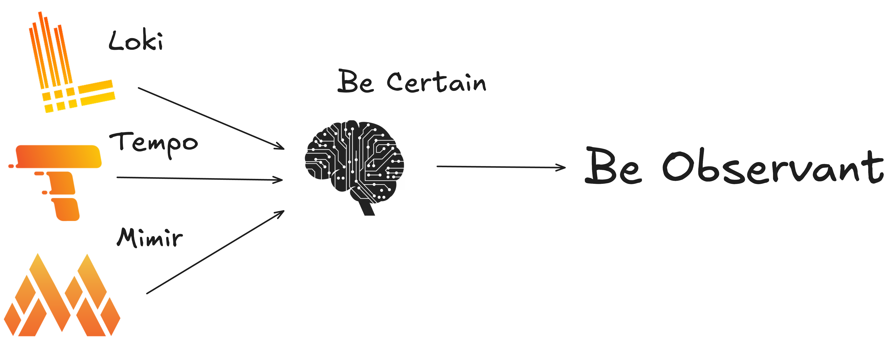
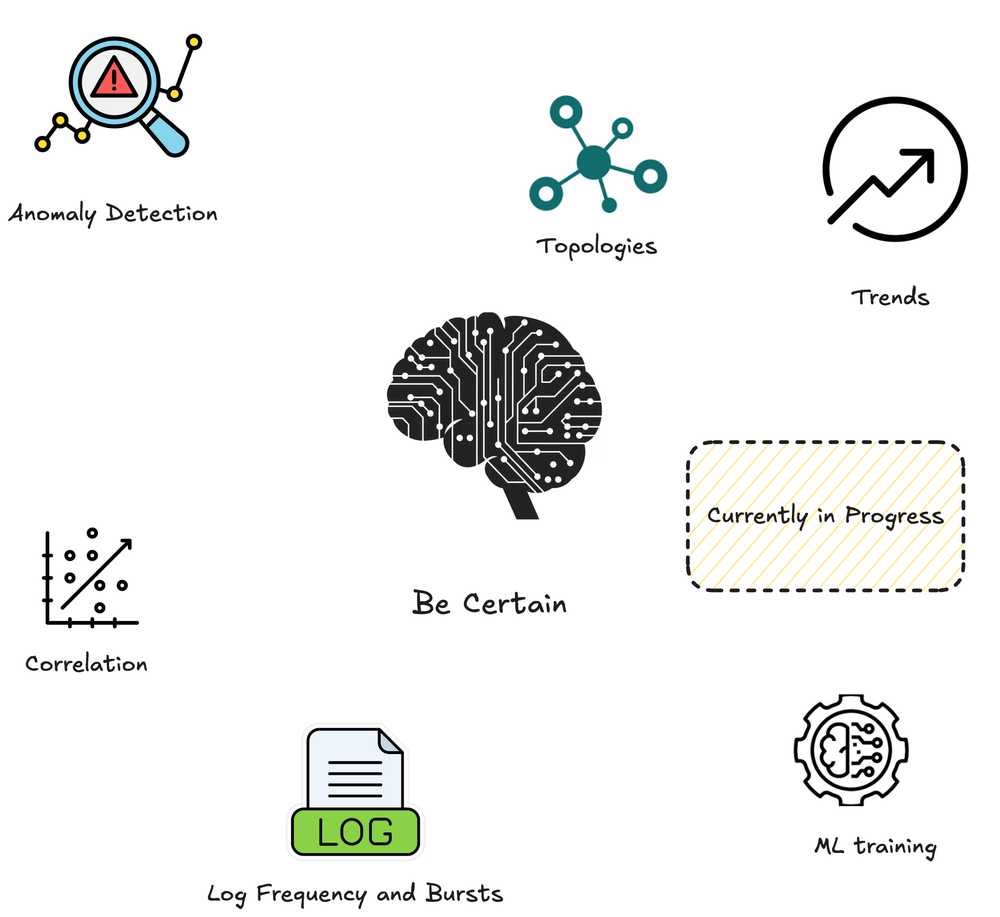

# Why Be Certain with your Infrastructure

Be Certain is a Python-based analytics engine designed to process, analyze, and correlate telemetry data from various sources. It offers features for anomaly detection, forecasting, causal analysis, event handling, and service level objective (SLO) monitoring and much more related to traces, logs and metrics. The architecture is modular, with separate packages for APIs, connectors, data sources, engines, store persistence, and tests. So users can easily drop in their own analysis package



## 🚀 Key Features

Be certain is currently being tested to ensure it is working as expected so we welcome PR to fix any bugs and issues



- 🧠 **Anomaly Detection**: Multiple algorithms for identifying unusual patterns in time-series data.
- 📈 **Forecasting & Baseline**: Predictive models and baseline computation for future trends.
- 🔄 **Correlation & Causal Analysis**: Tools to understand relationships between metrics and events.
- 📊 **SLO Monitoring**: Query templates and routes to compute service level objectives.
- 🔗 **Connectors**: Built-in support for Loki, Mimir, Tempo, and Victoria metrics stores.
- 🗃️ **Persistent Store**: Registry and client modules store results and configuration.
- 🧪 **Comprehensive Tests**: Suite of pytest tests for each component and functionality.


## ⚙️ Engine Analysis Pipeline

`POST /api/v1/analyze` runs a staged pipeline through the `engine/` package:

| Engine Module | Responsibility |
|---|---|
| `engine/analyzer.py` | Orchestrates the full RCA workflow: fetch, metric analysis, logs/traces analysis, SLO checks, correlation, causal scoring, ranking, and final report assembly. |
| `engine/fetcher.py` | Executes metric queries with bounded concurrency and fallback scrape behavior when query-range results are empty. |
| `engine/anomaly/*` | Parses time series (`series.py`) and detects anomalies (`detection.py`) with severity and change-type classification. |
| `engine/baseline/*` | Computes baseline bands and z-score references used by changepoint and anomaly interpretation. |
| `engine/changepoint/*` | Detects structural shifts/oscillation in metric behavior using CUSUM-style logic. |
| `engine/logs/*` | Detects log bursts and extracts repeated high-signal patterns from log streams. |
| `engine/traces/*` | Computes latency degradation (`p50/p95/p99`, apdex, error rate) and detects error propagation across services. |
| `engine/slo/*` | Calculates burn rate alerts and remaining error-budget status against target availability. |
| `engine/correlation/*` | Links anomalies across metrics/logs/traces in temporal windows and computes event confidence. |
| `engine/forecast/*` | Produces trajectory forecasts (time-to-threshold) and degradation signals from trends. |
| `engine/causal/*` | Computes Granger-style pair causality, causal graph roots/interventions, and Bayesian category posteriors. |
| `engine/rca/*` | Generates hypothesis objects from correlated evidence and scores/ranks likely root causes. |
| `engine/ml/*` | Clusters anomalies and ranks causes with rule+ML blended scoring. |
| `engine/topology/*` | Builds dependency graph views (blast radius, upstream roots, paths). |
| `engine/events/*` + `engine/registry.py` | Maintains tenant-scoped deployment/event context and adaptive signal weights used in confidence blending. |

## 🛠️ Project Structure

The engine is the brain of the Be Certain and it is connected inside the Analyzer.py

```
.
├── Dockerfile
├── LICENSE
├── README.md
├── api
│   ├── __init__.py
│   ├── requests
│   │   └── __init__.py
│   ├── responses
│   │   └── __init__.py
│   └── routes
│       ├── __init__.py
│       ├── analyze.py
│       ├── causal.py
│       ├── common.py
│       ├── correlation.py
│       ├── events.py
│       ├── exception.py
│       ├── forecast.py
│       ├── health.py
│       ├── logs.py
│       ├── metrics.py
│       ├── ml.py
│       ├── slo.py
│       ├── topology.py
│       └── traces.py
├── config.py
├── connectors
│   ├── __init__.py
│   ├── loki.py
│   ├── mimir.py
│   ├── tempo.py
│   └── victoria.py
├── datasources
│   ├── __init__.py
│   ├── base.py
│   ├── data_config.py
│   ├── exceptions.py
│   ├── factory.py
│   ├── helpers.py
│   ├── provider.py
│   └── retry.py
├── engine
│   ├── __init__.py
│   ├── analyzer.py
│   ├── anomaly
│   │   ├── __init__.py
│   │   ├── detection.py
│   │   └── series.py
│   ├── baseline
│   │   ├── __init__.py
│   │   └── compute.py
│   ├── causal
│   │   ├── __init__.py
│   │   ├── bayesian.py
│   │   ├── granger.py
│   │   └── graph.py
│   ├── changepoint
│   │   ├── __init__.py
│   │   └── cusum.py
│   ├── constants.py
│   ├── correlation
│   │   ├── __init__.py
│   │   ├── signals.py
│   │   └── temporal.py
│   ├── dedup
│   │   ├── __init__.py
│   │   └── grouping.py
│   ├── enums.py
│   ├── events
│   │   ├── __init__.py
│   │   └── registry.py
│   ├── fetcher.py
│   ├── forecast
│   │   ├── __init__.py
│   │   ├── degradation.py
│   │   └── trajectory.py
│   ├── logs
│   │   ├── __init__.py
│   │   ├── frequency.py
│   │   └── patterns.py
│   ├── ml
│   │   ├── __init__.py
│   │   ├── clustering.py
│   │   ├── ranking.py
│   │   └── weights.py
│   ├── rca
│   │   ├── __init__.py
│   │   ├── hypothesis.py
│   │   └── scoring.py
│   ├── registry.py
│   ├── slo
│   │   ├── __init__.py
│   │   ├── budget.py
│   │   └── burn.py
│   ├── topology
│   │   ├── __init__.py
│   │   └── graph.py
│   └── traces
│       ├── __init__.py
│       ├── errors.py
│       └── latency.py
├── main.py
├── pytest.ini
├── requirements.txt
├── run.py
├── store
│   ├── __init__.py
│   ├── baseline.py
│   ├── client.py
│   ├── events.py
│   ├── granger.py
│   ├── keys.py
│   ├── registry.py
│   └── weights.py
└── tests
    ├── conftest.py
    ├── test_anomaly_detection.py
    ├── test_api_models.py
    ├── test_api_routes_events.py
    ├── test_api_routes_slo.py
    ├── test_correlation.py
    ├── test_degradation.py
    ├── test_engine_causal.py
    ├── test_engine_weights.py
    ├── test_enums.py
    ├── test_events_registry.py
    ├── test_fetcher.py
    ├── test_forecast.py
    ├── test_fuzzy.py
    ├── test_helpers.py
    ├── test_logs.py
    ├── test_rca_hypothesis.py
    ├── test_retry.py
    ├── test_slo.py
    ├── test_store_baseline.py
    ├── test_store_client.py
    ├── test_store_granger.py
    ├── test_store_keys.py
    ├── test_store_registry.py
    ├── test_store_weights.py
    └── test_topology.py
```

## 📦 Installation

```bash
git clone https://github.com/StefanKumarasinghe/becertain.git
cd becertain
```

## ⚙️ Usage

Run the main application with Docker:

```bash
docker build -t becertain:latest .
docker run --rm -it \
    -p 8000:8000 \
    --name becertain \
    becertain:latest
```

or execute individual modules for development and debugging.

## 🧩 Contributing

Contributions are welcome! Please follow standard GitHub workflow with feature branches and pull requests. 

Ensure tests pass:

```bash
pytest -q
```

## 📄 License

This project is licensed under the [Apache License 2.0](LICENSE).
